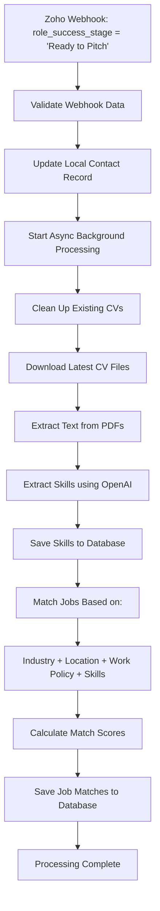

# Enhanced Zoho Webhook System for "Ready to Pitch" Contacts

This system automatically processes contacts when their `role_success_stage` is updated to "Ready to Pitch". It handles CV management, skill extraction using OpenAI, and intelligent job matching.

## Features

### 1. Webhook Processing
- **Trigger**: When `role_success_stage == "Ready to Pitch"`
- **Async Processing**: Uses background threads to prevent webhook timeouts
- **Single CV Management**: Automatically removes old CVs and downloads latest ones

### 2. CV Management
- Downloads latest CV attachments from Zoho CRM
- Removes existing CV files to maintain single CV per contact
- Stores document metadata in database

### 3. Skill Extraction
- Uses OpenAI GPT-3.5-turbo to extract skills from CV PDFs
- Categorizes skills (Technical, Programming, Language, Soft Skills, etc.)
- Estimates proficiency levels
- Stores extracted skills in database

### 4. Enhanced Job Matching
- **Industry Matching**: Matches based on `industry_1_areas`, `industry_2_areas`, `industry_choice_1`, `industry_choice_2`, `industry_choice_3`
- **Location Matching**: Considers contact location vs role location
- **Work Policy Matching**: 
  - Remote contacts → only remote roles
  - Office/Hybrid contacts → office, hybrid, or remote roles
- **Skill Matching**: Matches extracted CV skills with role requirements
- **Scoring Algorithm**: Weighted scoring with industry (40%), location (25%), work policy (20%), skills (15%)

## API Endpoints

### Webhook Endpoint
```
POST /webhook/zoho/contact/
```
Main webhook endpoint for Zoho CRM notifications.

### Test Endpoints
```
POST /webhook/test-ready-to-pitch/
```
Simulate "Ready to Pitch" webhook processing.

```
POST /webhook/manual-cv-extraction/{contact_id}/
```
Manually trigger complete CV processing for a contact.

### Job Matching Endpoints
```
POST /webhook/jobs/match/{contact_id}/
GET /webhook/jobs/matches/{contact_id}/
```
Trigger job matching and retrieve matches.

### Skills Endpoints
```
GET /webhook/skills/{contact_id}/
```
Get extracted skills for a contact.

## Configuration

### Environment Variables
```bash
OPENAI_API_KEY=your_openai_api_key_here
WEBHOOK_SECRET=your_webhook_secret_key_here
CV_DOWNLOAD_DIR=downloads/cvs
```

### Django Settings
```python
# In settings.py
CV_DOWNLOAD_DIR = 'downloads/cvs'
WEBHOOK_SECRET = 'your_webhook_secret_key_here'

# Logging configuration
LOGGING = {
    'version': 1,
    'disable_existing_loggers': False,
    'handlers': {
        'file': {
            'level': 'INFO',
            'class': 'logging.FileHandler',
            'filename': 'django.log',
        },
    },
    'loggers': {
        'zoho_app': {
            'handlers': ['file'],
            'level': 'INFO',
            'propagate': True,
        },
        'etl': {
            'handlers': ['file'],
            'level': 'INFO',
            'propagate': True,
        },
    },
}
```

## Usage

### 1. Testing with Management Command
```bash
python manage.py test_ready_to_pitch <contact_id> --verbose --cleanup
```

### 2. Manual Testing via API
```bash
# Test Ready to Pitch workflow
curl -X POST http://localhost:8000/webhook/test-ready-to-pitch/ \
  -H "Content-Type: application/json" \
  -d '{"contact_id": "123456789"}'

# Manual CV extraction and processing
curl -X POST http://localhost:8000/webhook/manual-cv-extraction/123456789/

# Get job matches
curl http://localhost:8000/webhook/jobs/matches/123456789/?limit=5

# Get extracted skills
curl http://localhost:8000/webhook/skills/123456789/
```

### 3. Webhook Configuration in Zoho
1. Go to Zoho CRM → Setup → Automation → Workflows
2. Create new workflow for Contacts
3. Set trigger: Field update on `Role Success Stage`
4. Add webhook action:
   - URL: `https://yourdomain.com/webhook/zoho/contact/`
   - Method: POST
   - Format: Form Data or JSON

## Workflow Process



## Database Models

### Enhanced Models
- **Contact**: Added `role_success_stage` field
- **Document**: Stores CV file metadata
- **Skill**: Stores extracted skills with categories and proficiency
- **JobMatch**: Stores job matches with detailed scoring

### Matching Criteria
1. **Industry Match** (40% weight): Contact's industry preferences vs role tags
2. **Location Match** (25% weight): Geographic compatibility
3. **Work Policy Match** (20% weight): Remote/office/hybrid compatibility  
4. **Skill Match** (15% weight): CV skills vs role requirements

## Error Handling

- Webhook timeouts prevented by async processing
- OpenAI API failures logged and handled gracefully
- File I/O errors handled with cleanup
- Database transaction rollbacks on failures
- Comprehensive logging for debugging

## Performance Considerations

- Background thread processing prevents webhook timeouts
- Single CV management reduces storage overhead
- Efficient database queries with indexes
- OpenAI API calls optimized with token limits
- Batch processing capabilities for multiple contacts

## Monitoring

Check logs in `django.log` for:
- Webhook processing status
- CV download results
- Skill extraction results
- Job matching statistics
- Error details and stack traces

## Security

- Webhook signature verification
- API key protection for OpenAI
- File path validation for downloads
- SQL injection protection via Django ORM
- Input validation on all endpoints
